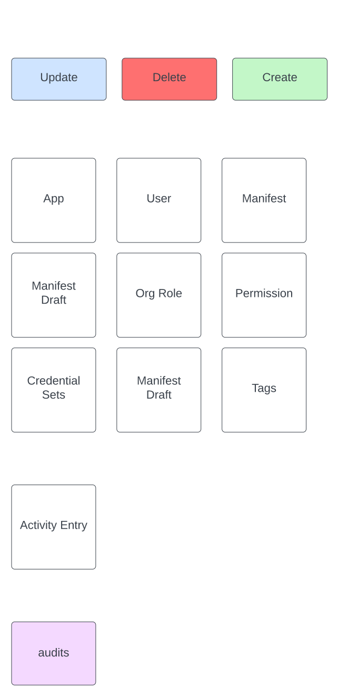
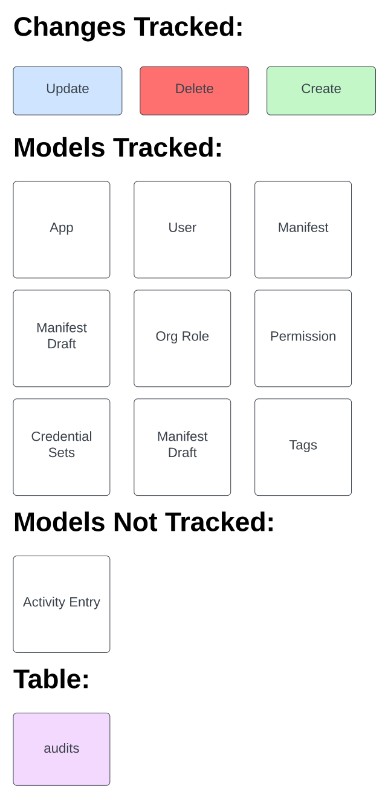

<script setup>
import { useData } from 'vitepress'
const { isDark } = useData()
</script>

# Audits 

Trivial-API leverages the [Audited gem](https://github.com/collectiveidea/audited) to log and monitor alterations across models. Any Create, Delete, or Update actions performed on Objects are documented within the `audits` table.

## Audits Diagram

<div>
  
  
</div>

### Note on `user_id`:

The `user_id` column in each audit entry provides information about the user responsible for a change within an object. This column is populated when a user signs in and is typically filled in for all audit entries. However, there's a specific scenario where the `user_id` is left blank – when a user accepts an invitation. This behavior is due to the fact that accepting an invitation doesn't require a user to sign in or undergo authentication. 

To uncover the `user_id` associated with an accepted invitation, we recommend identifying the audit entry linked to the creation of an `OrgRole`. You can pinpoint this entry by looking for a blank or null `user_id`, along with the `CREATE` value in the `action` column and the `OrgRole` value in `autible_type` column. Once you've located this entry, a quick check of the `audit_changes` column will unveil the `user_id` of the user who accepted the organization invitation


## Interacting with Audits via Console

The Audited gem allows users to retrieve relevant information in regards to model changes. Here are two commands available to use.

::: tip
To access the console, type the following: `bundle exec rails c`
:::

::: code-group
``` [Command]
user = User.find(1)
user.audits.last
user.audits.count
```

``` [Response]
=> #<User id: 1, provider: "email", uid: "admin@email.com", name: "admin", email: "admin@email.com", created_at: "2023-12-18 20:54:50.043892000 +0000", updated_at: "2024-01-22 19...
=>                                                                                     
#<Audited::Audit:0x00000001132744f8                                                    
 id: 184,                                                                              
 auditable_id: 1,                                                                      
 auditable_type: "User",                                                               
 associated_id: nil,                                                                   
 associated_type: nil,                                                                 
 user_id: 1,                                                                           
 user_type: "User",                                                                    
 username: nil,                                                                        
 action: "update",                                                                     
 audited_changes: {"tokens"=>"[FILTERED]"},                                            
 version: 16,                                                                          
 comment: nil,
 remote_address: "127.0.0.1",
 request_uuid: "c331612d-25c7-4c4b-b783-cf84e4715146",
 created_at: Mon, 22 Jan 2024 19:54:23.916760000 UTC +00:00>
 => 16
```
:::
