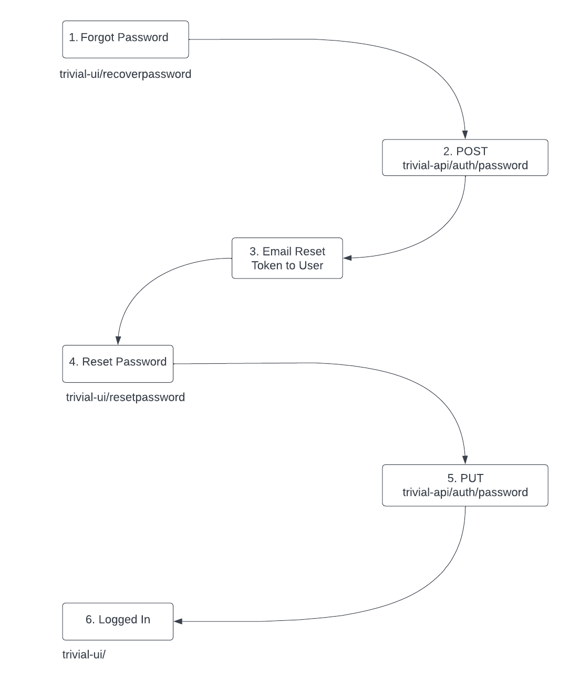

# Passwords
There are endpoints for creating/updating a password through the Trivial-API.s
## Creating/Updating a password endpoints

`/signnup` - for creating a user.

`/changepassword` - used when a logged in user opt in to change their password internally.

`/recoverpassword/resetpassword` - used when a NOT logged in user tries to change their password.

`/acceptinvite`- used when a user has to accept an invite to an organization.

## Reset Password Flow Chart
Here is an outline of the steps involved with using `/recoverpassword` endpoint.

## Password Requirements
See [https://github.com/solid-adventure/trivial-api/pull/195](https://github.com/solid-adventure/trivial-api/pull/195)