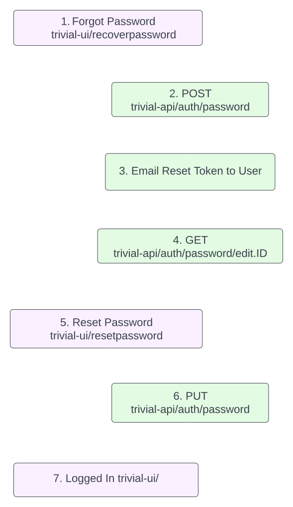
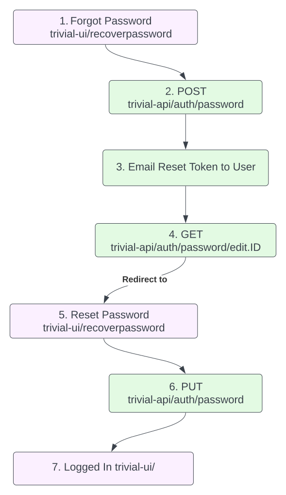
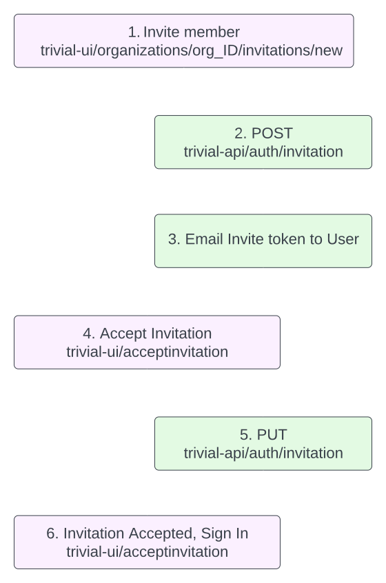

# Passwords
The creation and resetting of passwords interacts with several endpoints across trivial-ui and trivial-api, this guide provides the general flow. For actual implementations of the API calls, the repos themselves are the definitive source.

## Registration
To undergo a sign up the user must navigate to the `/register` path via trivial-ui. Once the user fills out the form. A post request is sent to the endpoint `/auth` at trivial-api.

::: info
By default, new user registration is disabled. Set the env var `ENABLE_REGISTRATION=TRUE` and restart the server to enable.
To create a one-off user without enabling registration, visit [http://localhost:3000/register](enableFeatures=registration)

:::

::: tip Please note that passwords require a minimum length of 12 characters, the inclusion of at least one uppercase letter, one lowercase letter, one digit, and one symbol or special character.
:::

## Resetting Password
Outline of the steps involved with resetting a password. 

  
  

::: info

Note on Step 4: 

The `redirect_url` for `http://[redirect_url]/resetpassword` can be set [here](https://github.com/solid-adventure/trivial-ui/blob/e74d0b8790f9dafce6a318c7441bf0ce0e2be909/source/components/RecoverPassword.vue#L77C24-L77C24). In a future release, this will be configurable via an environment variable. See [solid-adventure/trivial-ui#27](https://github.com/solid-adventure/trivial-ui/issues/27)

Note on Step 6:

Manual attempts to replicate this call requires adding query parameters after `/auth/password`. This can be found in logs after the redirection_url.

Example output in log: 

`Redirected to http://[redirection_url]/resetpassword?[query_parameters]`

:::

## Changing Password
Changing password when signed in is done through the `/changepassword` path at trivial-ui. Once the current, new, and confirmed password are submitted via the form, a `PUT` request is sent to `/auth/password` endpoint at trivial-api.

## Invitations

Flow diagram between endpoints within trivial-ui and trivial-api for invitations.

  
  

