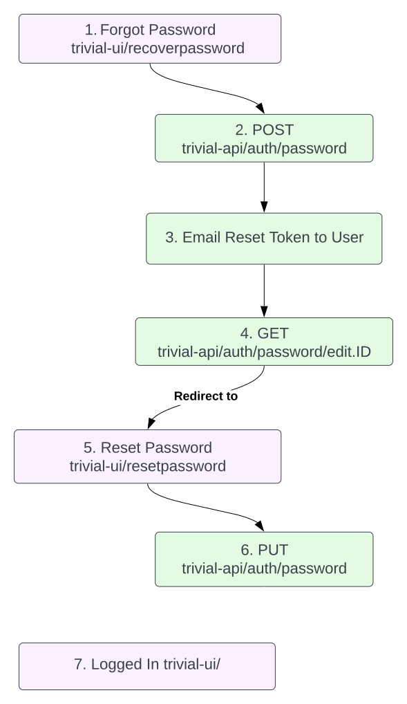

<script setup>
import { useData } from 'vitepress'
const { isDark } = useData()
</script>

# Passwords
The creation and resetting of passwords is a process that interacts with many endpoints and frontend paths. This guide breaks down every single step. 

## Signing Up
To undergo a signup the user must navigate to the `/register` path via trivial-ui. Once the user fills out the form. A post request is sent to the endpoint `/auth`at trivial-api.  Here is a sample post request: 

::: tip Please note that passwords require a minimum length of 12 characters, the inclusion of at least one uppercase letter, one lowercase letter, one digit, and one symbol or special character.
:::

::: code-group
```javascript [Request]
const organization = await fetch('http://localhost:3000/auth', {
  method: "POST",
  headers: {
    'Content-Type': 'application/json',
  },
  body: JSON.stringify({
    "name": "User Name",
    "email": "user@email.com",
    "password": "SamplePass!789"
  })
})
.then(response => response.json())
```
```json [Response]
organization: {
    "status": 'success',
    "data": {User Metadata}
}
```
:::

## Resetting Password
Here is an outline of the steps involved with using `/recoverpassword` endpoint. 

<div align = "center">
  
  
</div>

Sample Request for Step 2: 

::: code-group
```javascript [Request]
await fetch("http://localhost:3000/auth/password", {
  method: "POST",
  headers: {
    "Content-Type": "application/json"
  },
  body: JSON.stringify({
    "email" : "user@email.com",
    "redirect_url": "https://www.trivialapps.io/resetpassword"
  }),
})
.then((response) => response.json())
```
```json [Response]
{
  success: true,
  message: "An email has been sent to 'user@email.com' containing instructions for resetting your password."
}  
```
:::

Sample Request for Step 4: 

::: code-group
```javascript [Request]
  await fetch("http://localhost:3000/auth/password/edit.1?config=default&redirect_url=http://localhost:4000/resetpassword&reset_password_token={token}}", {
  method: "GET",
  headers: {
    "Content-Type": "application/json"
  }
})
.then((response) => response.json())
```
```json [Response]
{
}  
```
:::

Please note that the `redirect_url` in the example is set to http://localhost:4000/resetpassword. Changes to the `redirect_url` can be made [here](https://github.com/solid-adventure/trivial-ui/blob/e74d0b8790f9dafce6a318c7441bf0ce0e2be909/source/components/RecoverPassword.vue#L77C24-L77C24).

Sample Request for Step 6: 

::: code-group
```javascript [Request]
  await fetch("http://localhost:3000/auth/password?access-token={access-token}&client={client}&client_id={client_id}&config=default&expiry={expiry}&reset_password=true&token={token}&uid={email}", {
  method: "GET",
  headers: {
    "Content-Type": "application/json"
  },
  body: JSON.stringify({
    "password" : "SamplePass!789",
    "password_confirmation" : "SamplePass!789",
  }),
})
.then((response) => response.json())
```
```json [Response]
{
  success: true,
  data: { User Metadata },
  message: 'Your password has been successfully updated.'
}
```
:::

Query parameters after `/auth/password` for step 6 can be found in logs after the redirection_url.

Example output in log: 

`Redirected to http://redirection_url/resetpassword?query_parameters`

## Changing Password
Changing password when signed in is done through the `/changepassword` path at trivial-ui. Once the current, new, and confirmed password are submitted, a PUT request is sent to `/auth/password` at trivial-api. Here is a sample request: 
::: code-group
```javascript [Request]
await fetch("http://localhost:3000/auth/password", {
  method: "PUT",
  headers: {
    "Content-Type": "application/json",
    "Authorization":"Bearer yyyy"
  },
  body: JSON.stringify({
    "password" : "NewPassword!789",
    "password_confirmation" : "NewPassword!789",
    "current_password" : "SamplePass!789"
  }),
})
.then((response) => response.json())
```
```json [Response]
{
  "success": true,
  "data": {User Metadata},
  "message": "Your password has been successfully updated."
}
```
:::
## Accepting Invite
Accepting an invite through trivial-ui begins with signing in or creating account through the `/acceptinvitation` path. Once you're information has been filled out, trivial-ui send a PUT request to the `auth/invitaiton` endpoint at trivial-api to confirm your invitation. Here is a sample request:
::: code-group
```javascript [Request]
  await fetch("http://localhost:3000/auth/invitation", {
  method: "PUT",
  headers: {
    "Content-Type": "application/json"
  },
  body: JSON.stringify({
    "invitation_token": "qRyvCYBszHt7A1aWacyF",
    "password": "SamplePass!789",
    "password_confirmation": "SamplePass!789"
  }),
})
.then((response) => response.json())
```
```json [Response]
{
  success: [ 'Invite Accepted']
}  
```
:::